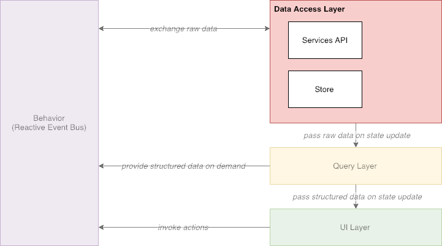
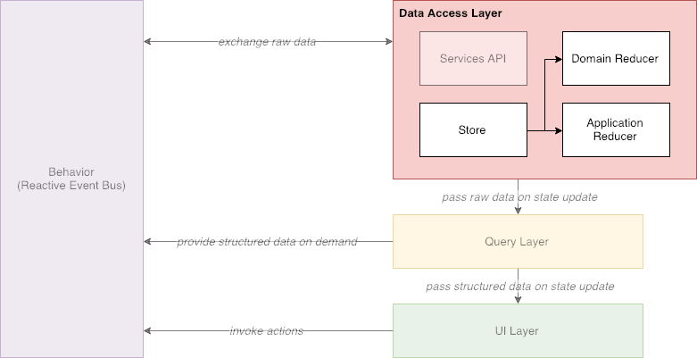
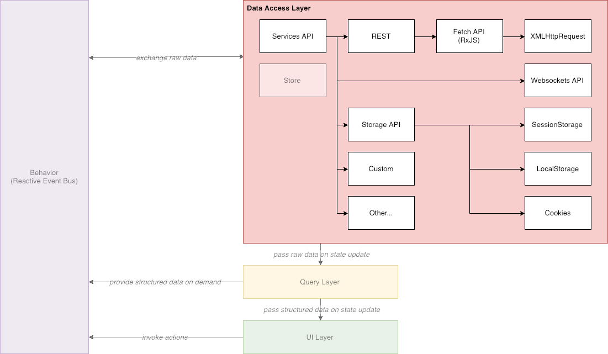

# Data Access Layer

## Overview

**Data Access Layer** \(**DAL**\) serves as the only root access point for all raw domain data. It consists of [Redux](https://redux.js.org/) store and a bunch of services, that fetch data from server or any other data storage \(e.g. _localStorage_\). It can be accessed from **Behavior** module of from **Query Layer**.

## Store

The structure of our store is pretty simple. It's split into to branches: domain data and application data. Combined reducers are used in order to maintain this structure.

Domain reducers mostly work with data, that comes from server \(e.g. feed\). And application reducers work with a derived data, generated in a run-time \(e.g. currently active page\).

## Services

Services are just wrappers around generic I/O operations \(REST requests, Websockets streams, localStorage I/O's, etc.\). They normally provide friendly API for reading/writing models data. Most of the services can be both generic and feature specific.

Each service usually get's invoked directly from action creator or middleware and should normally trigger corresponding actions on operation success or failure.

