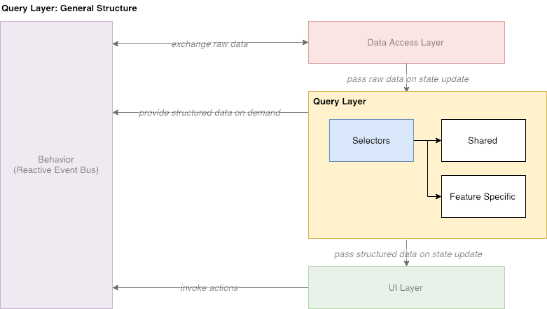

# Query Layer

## Overview

**Query Layer** fetches data from **DAL** and provides it to any other consumer. It does NOT write any data to store and does NOT trigger any actions and/or events. It consists of tons of re-usable selectors, that can accessed both by components from the **UI Layer** and by action creators \(or middleware\) from **Behavior** module.

## Selectors Structure

All selectors are split into two categories: shared and feature specific.

Shared selectors contain logic for performing some atomic or commonly used data fetches. These selectors can also be compose of other shared selectors.

Feature specific selectors are normally used by a single component only and are usually composed of other selectors.

