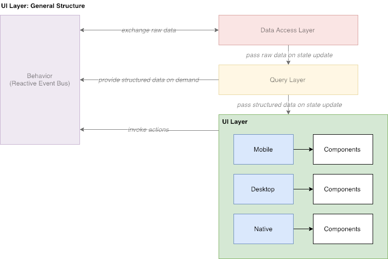
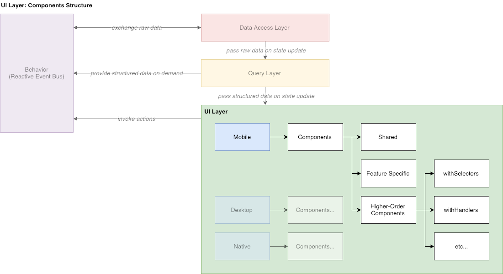

# UI Layer

## Overview

**UI Layer** mostly contains presentational components and does almost zero business logic. All [React](https://reactjs.org) components, that we use, reside on this layer only. The main feature of this layer - its interchangeability. It can be completely removed from the application and replaced by any other UI implementation, or it can just have different variations for each device, for example.

In our application we are going to support three variations: mobile, desktop and [React Native](https://facebook.github.io/react-native/). At the moment only mobile version is supported.

## Components Structure

**UI Layer** consists of tons of components. In order to make it easier to maintain them, all components should be organized as shown below:

All components generally can be split into three categories: shared, feature specific and [HOC](https://reactjs.org/docs/higher-order-components.html)'s.

Shared components are intended to be use throughout the whole application \(e.g. odds\).

Feature specific components are usually used once for some particular feature \(e.g. betslip\) and, therefore, there is no way \(and no need\) to re-use them.

[HOC](https://reactjs.org/docs/higher-order-components.html)'s are just a bunch of components, required for providing common enhancements for any other component \(e.g. _withRouter_, that will inject router API and current route information into the components properties\).

## Data Retrieval

All components are connected to application store via selectors \(that reside in query layer\). We are using default [react-redux](https://github.com/reduxjs/react-redux) approach for this purpose.

